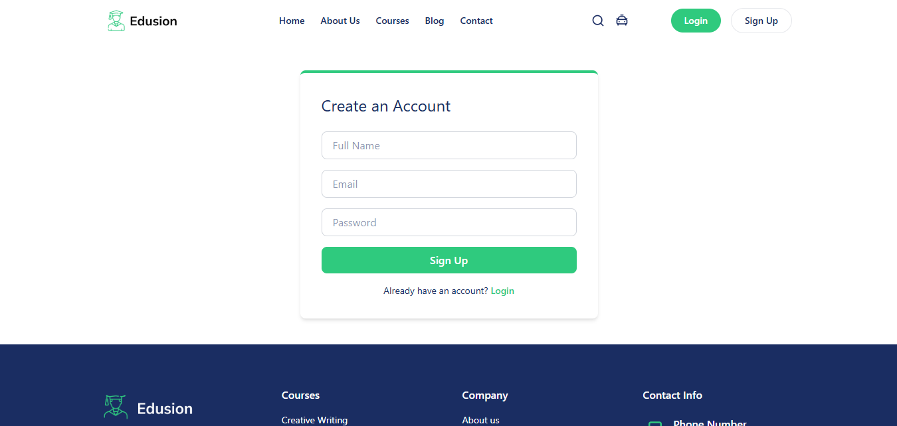
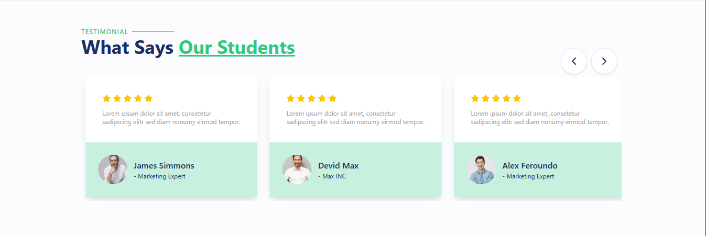

# Edusion - Online Learning Platform

Edusion is a modern, responsive e-learning platform built with **React**, **Vite**, and **TailwindCSS**. It allows users to browse courses, read blogs, contact support, and manage authentication with a smooth and intuitive user interface.

[](https://omar-aldabbas.github.io/edusion/)

## Table of Contents

1. [Project Overview](#project-overview)  
2. [Features](#features)  
3. [Technologies Used](#technologies-used)  
4. [Screenshots](#screenshots)  
5. [Installation](#installation)  
6. [Deployment](#deployment)  
7. [Contributing](#contributing)  
8. [License](#license)  

## Project Overview

Edusion is a fully responsive educational platform providing users with a seamless experience to explore courses, read blogs, contact instructors, and manage their learning journey. The platform features smooth animations, interactive sections, and a user-friendly interface across both desktop and mobile devices.

Users can easily browse and filter a wide range of courses, read informative blog posts, contact support, and access their accounts via secure authentication. The platform incorporates interactive sections such as FAQs, testimonials, and featured courses to enhance user engagement.

Key highlights of Edusion include:

- **Responsive Design:** Optimized for both desktop and mobile devices, ensuring a consistent and enjoyable experience across all screen sizes.  
- **Smooth Navigation:** Sticky and animated navigation bars, scroll-to-top functionality, and intuitive mobile menus for easy access.  
- **Course Exploration:** Detailed course pages with filtering options to help users find the right learning material quickly.  
- **User Interaction:** Contact forms, interactive FAQs, and testimonial sections enhance user engagement.  
- **Authentication System:** Login and signup pages for managing user accounts securely.  
- **Visual Appeal:** Clean, modern UI with smooth transitions, hover effects, and animated sections to create a professional feel.  

The project is deployed on **GitHub Pages**, making it publicly accessible for testing and demonstration.


## Features  

Edusion comes with a variety of modern features that make the platform user-friendly, responsive, and visually appealing.  

### 🔹 Responsive Navigation Bar  
A clean, fully responsive navigation bar optimized for **desktop, tablet, and mobile devices**.  
<p>
  
  
  
</p>

---

### 🔹 Course Browsing  
Easily explore courses with detailed previews and adaptive layouts for every device.  
<p>
  
  
  
</p>

---

### 🔹 Authentication (Login & Signup)  
Secure login and signup pages, designed for smooth user interaction across devices.  
<p>
  
  
  
</p>

---

### 🔹 Contact Form  
Reach out to support or instructors with a fully responsive contact form.  
<p>
  
</p>

---

### 🔹 Testimonials  
Showcase of student feedback in an engaging, responsive design.  
<p>
  
  
</p>

---

### 🔹 Trusted By Section  
A visual showcase of trusted partners and platforms endorsing Edusion.  
<p>
  
</p>


## Technologies Used  

Edusion is built using a modern frontend stack to ensure performance, scalability, and responsiveness:  

- **React** – Component-based UI library for building the interface.  
- **Vite** – Lightning-fast build tool and development server.  
- **Tailwind CSS** – Utility-first CSS framework for rapid UI development.  
- **React Router** – For client-side routing and navigation.  
- **GitHub Pages** – Deployment and hosting of the project.  


## Screenshots  

<p align="center">
  
  
  
</p>


## Installation

```bash
# Clone the repository
git clone https://github.com/Omar-Aldabbas/edusion.git

# Navigate into the project folder
cd edusion

# Install dependencies
npm install

# Start the development server
npm run dev
```

## Deployment

This project is deployed using **GitHub Pages**.  

To deploy manually:  

```bash
# Build the project
npm run build

# Deploy the dist folder to GitHub Pages
npm run deploy
```

## Contributing

Contributions are welcome! 🎉  
If you’d like to contribute to **Edusion**, please follow these steps:

1. **Fork** the repository.  
2. **Create a new branch** for your feature or fix:  
   ```bash
   git checkout -b feature-name
   git commit -m "Add new feature"
   git push origin feature-name
   ```

## License

This project is licensed under the **MIT License**.

MIT License

Copyright (c) 2025 Omar Aldabbas


